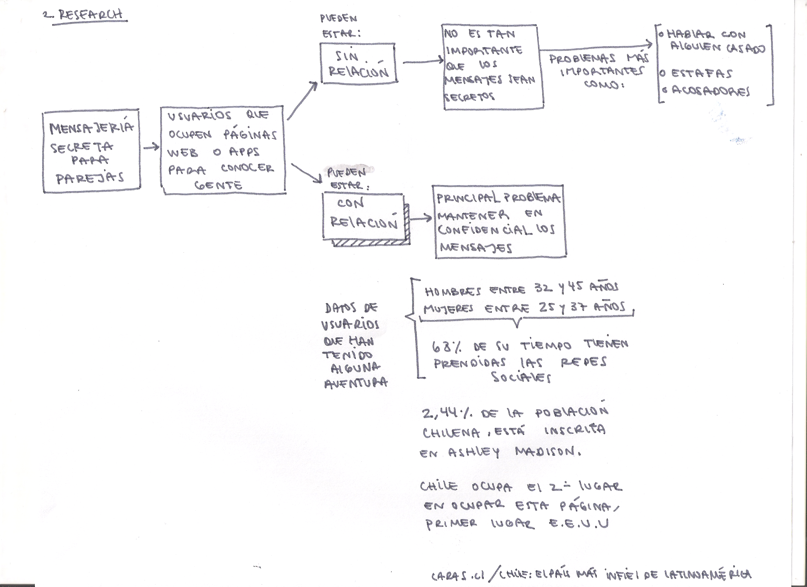
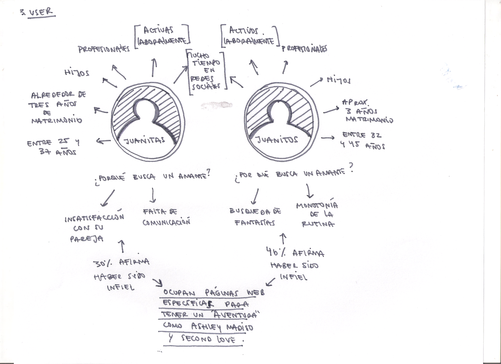
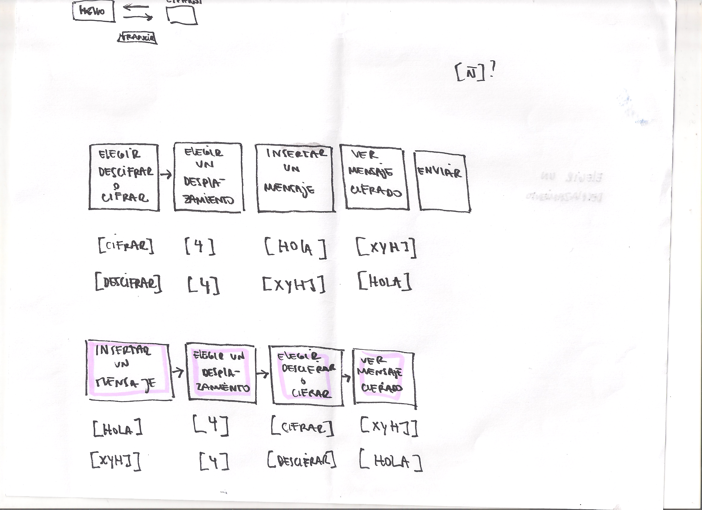
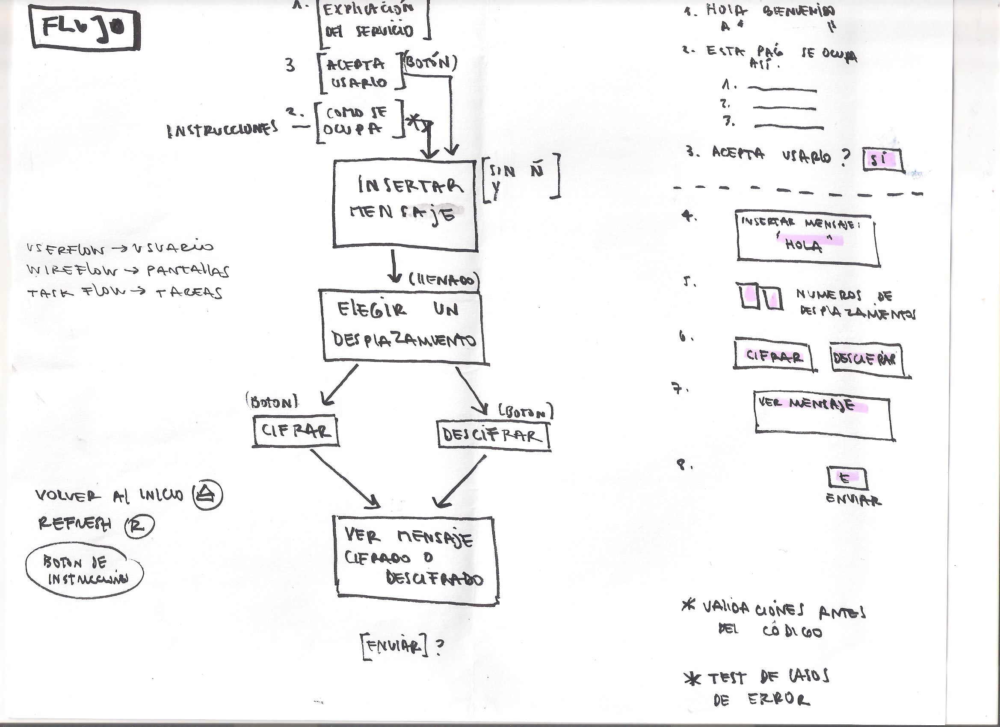
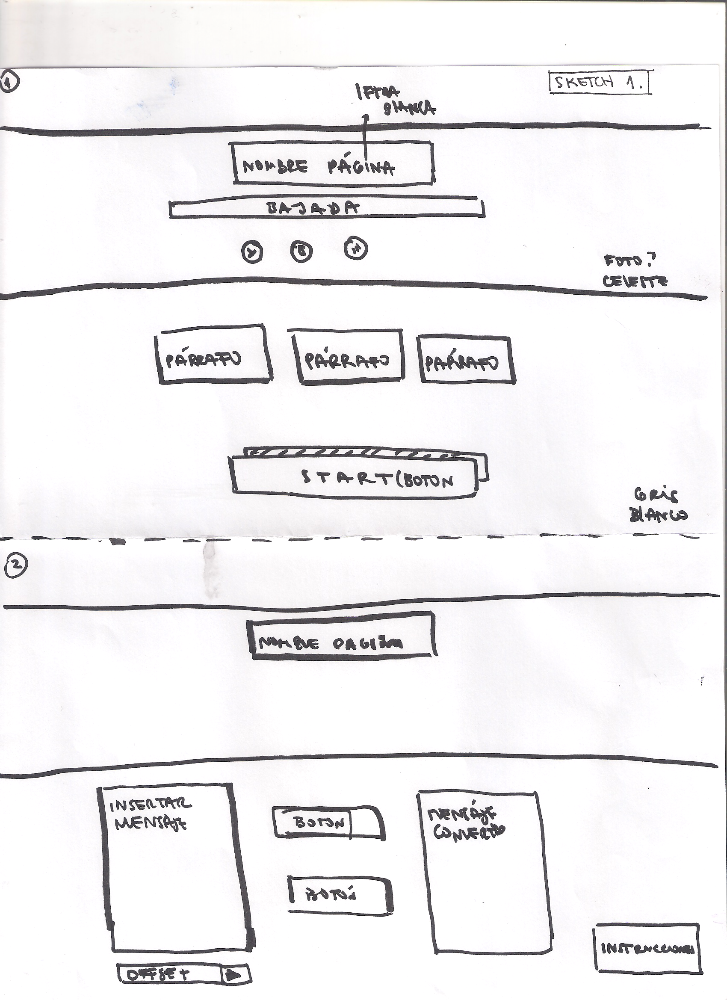
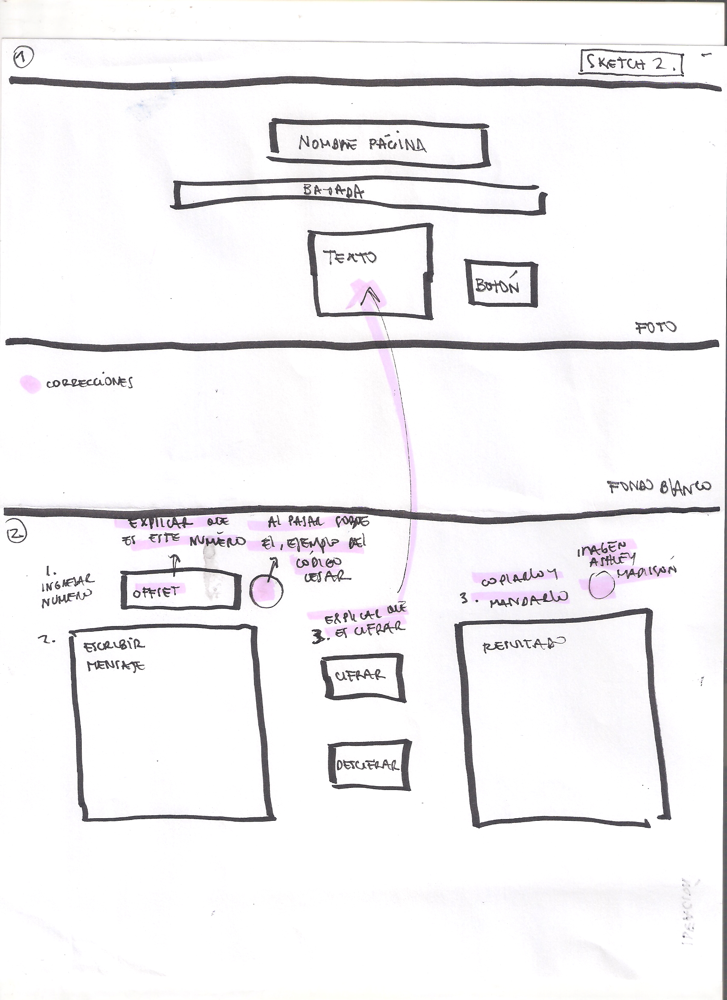

# EnClave
***

## descripción(para el usuario)
***
EnClave es una pagina web que ofrece enviar mensajes amorosos entre personas que ya tienen una relación, entregando seguridad al usuario de que sus mensajes no serán leido por su pareja o una tercera persona, ya que ocupa el sistema de cifrado César. 

 Utiliza el cifrado César que codifica por sustitución, reemplazando las letras originales de sus mensajes por letras del mismo abecedario que estan  más adelante,colocandole el número de la posición de estas letras.

 Este número de posición se escribe en el offset, y el mensaje al apretar el botón cifrar codificará el mensaje y viceversa, dando la opción de borrar el mensaje de inmediato también.

## investigación(para el desarrollador)
***
Se tomo como punto de inicio la situación de los <b>mensajes</b> secretos para parejas, estas personas que ocupan páginas web o apps para conocer gente, se pueden dividir en dos grupos los que buscan conocer gente estando solteros y los que buscan ya estando en  una relación.

Para los que estan solteros no es tan importante que los mensajes sean secretos, sino que tienen otros problemas como que hablar con alguien que no es quien dice ser, que los estafen o los acosen.

<b>Mientras  los que ya estan en una relación su principal problema es mantener la confidencialidad de los mensajes.</b> 
-Según una encuesta entregada por Adimark el 30% de las mujeres afirma haber sido infiel y un 46% los hombres. 
-La página Ashley Madison que su servicio es conocer gente para tener aventuras,reveló que Chile es el segundo pais que más ocupa su página, en primer lugar esta Estados Unidos.

## Definición usuario
***
Los usuarios para los cuales esta enfocado esta página son mujeres y hombres entre los 25 y 45 años de edad, que ya tienen mas de tres años en una relación,son profesionales, activos profesionalmente, dedican mucho tiempo a las redes sociales y estan abierto a la opción de la "infidelidad virtual".

 

## Problemática
***
La necesidad de nuestro usuario es <b>enviar información delicada a otro con total garantía que no sera accesible a otro</b>, proteger su privacidad. 

Actualmente existen páginas web y apps para conocer gente que ya tiene una relación, el problema es la seguridad de los mensajes. 

<b>Es por eso que se diseño una página web que codifica mensajes para mantener la privacidad y luego que el mensaje está codificado se puede mandar a través de las páginas existentes.</b>

 ## Interfaz
 ***
En el desarrollo de la interfaz con el usuario primero se planificó los pasos para ocupar el cifrado, como se vé en la imagen el segundo orden es el que se ocupó:
- 1.Se inserte un mensaje. 
- 2.Se elija un desplazamiento. 
- 3.Se elija cifrar o descifrar. 
- 4.Se vea el mensaje cifrado o descifrado. 

## Flujo 
***
Una vez ya teniendo claro los pasos para el cifrado, se desarrollo el flujo del recorrido del usuario: 
- 1.Se entra a la página. 
- 2.Se explica el servicio de la página. 
- 3.Se da la opción para que el usuario pueda continuar en la página. 
- 4.Se ven pequeños parrafos con las instrucciones para ocupar el cifrado con las pasos anteriores. 
- 5.Una vez terminado, tiene la opción de borrar el mensaje.

## Desiciones de diseño
***
Se trabajó con dos pantallas, en la primera se presenta el servico al usuario y en la segunda puede acceder al servicio, se hace esto porque el usuario especípifico de esta página necesita que sea discreto que no llame la atención y no revele altiro el cifrado, los colores de la página tambien reflejan un lugar tranquilo, que entregue seguridad a través de los tonos celestes, blancos y en menor proporción negro para dar seriedad a la página.
Como se ven en las imagenes de abajo, el primer sketch es de la idea inicial de las pantallas,el segundo sketch tiene modificaciones para hacer más fácil el recorrido por la pantalla, se colocan dos áreas de texto y entremedio los botones para que la acción de cifrar o descifrar se haga de izquiera a derecha. 

## Planificación
<https://trello.com/b/nZeugIb3/cipher>
 

 

