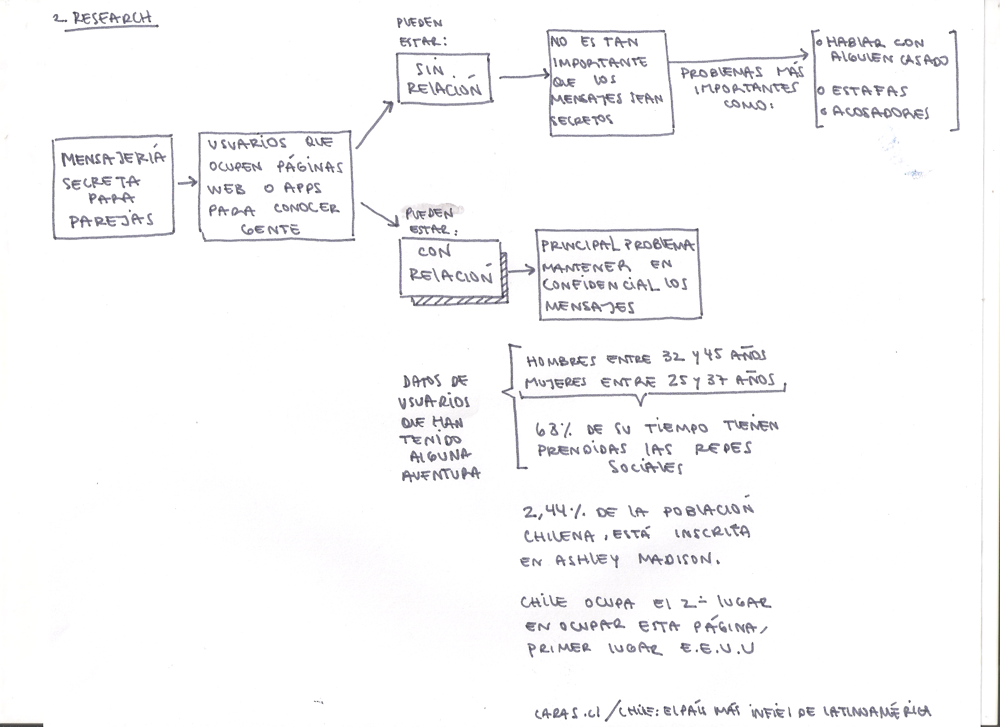
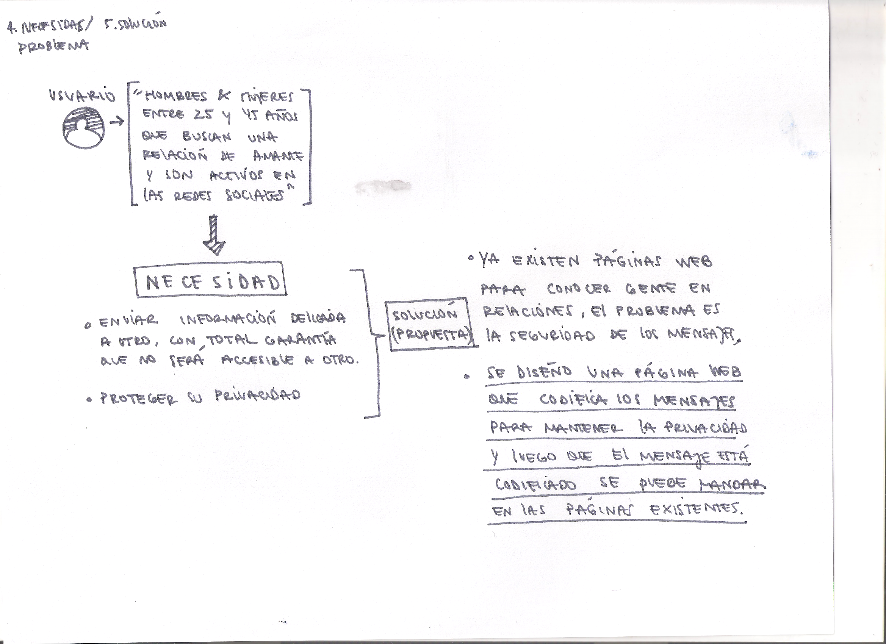

titulo pagina : <h1>EnClave</h1>

<h2>descripción</h2>
Es una pagina web que ofrece enviar mensajes amorosos entre personas que ya tienen una relación, entregando seguridad al usuario de que sus mensajes no serán leido por su pareja o una tercera persona, ya que ocupa el sistema de cifrado César que codifica por sustitución, reemplazando las letras originales de sus mensajes por otras de más adelante,colocandole un numero de desplazamiento.

<h2>investigacion</h2>
Se tomo como punto de inicio la situación de los <b>mensajes</b> secretos para parejas, estas personas que ocupan páginas web o apps para conocer gente, se pueden dividir en dos grupos los que buscan conocer gente estando solteros y los que buscan ya estando en  una relación.

Para los que estan solteros no es tan importante que los mensajes sean secretos, sino que tienen otros problemas como que hablar con alguien que no es quien dice ser, que los estafen o los acosen.

<b>Mientras  los que ya estan en una relación su principal problema es mantener la confidencialidad de los mensajes.</b> 
-Según una encuesta entregada por Adimark el 30% de las mujeres afirma haber sido infiel y un 46% los hombres. 
-La página Ashley Madison que su servicio es conocer gente para tener aventuras,reveló que Chile es el segundo pais que más ocupa su página, en primer lugar esta Estados Unidos.

<h2>Definición usuario</h2>
Los usuarios para los cuales esta enfocado esta página son mujeres y hombres entre los 25 y 45 años de edad, que ya tienen mas de tres años en una relación,son profesionales, activos profesionalmente, dedican mucho tiempo a las redes sociales y estan abierto a la opción de la "infidelidad virtual".

 

<h2>Problemática</h2>
La necesidad de nuestro usuario es <b>enviar información delicada a otro con total garantía que no sera accesible a otro</b>, proteger su privacidad. 

Actualmente existen páginas web y apps para conocer gente que ya tiene una relación, el problema es la seguridad de los mensajes. 

<b>Es por eso que se diseño una página web que codifica mensajes para mantener la privacidad y luego que el mensaje está codificado se puede mandar a través de las páginas existentes.</b>

<h2>Interfaz</h2>

 

 

